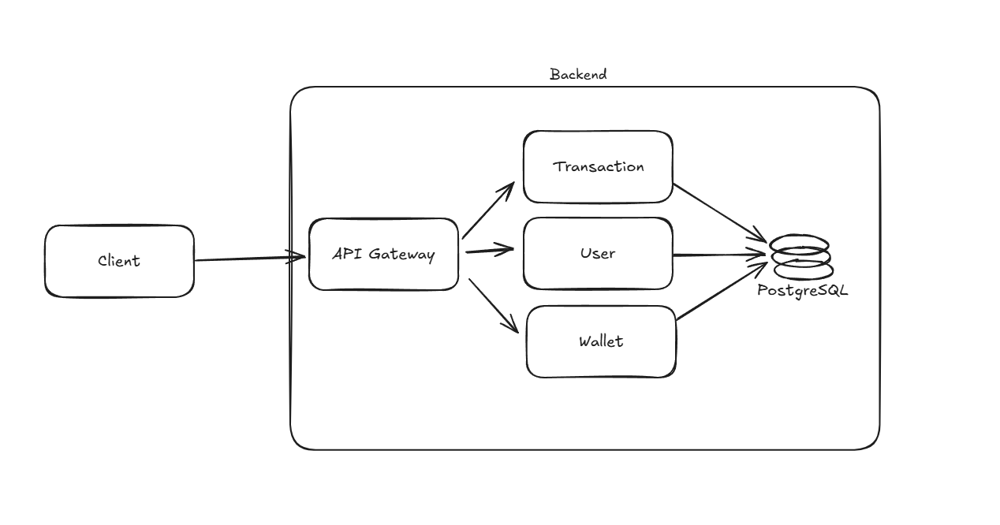

# First Architectural Idea for Wallet Service Assignment

This document contains information about the initial architectural ideas for project 'Wallet Service Assignment' and insights into the technologies and tools used in early commits.

---

---

The main goal is to structure the application domains based on the principles of Domain-Driven Design (DDD). To support the domain decomposition process, I adopted the hexagonal architecture. In order to follow DDD principles as closely as possible and avoid cross-domain coupling, I used Spring Modulith, which enables event publishing and listening.

I structured the application into three main domains: wallets, users, and transactions. For data persistence, I chose PostgreSQL — a robust, consistent, and Spring-compatible relational database that allows for strong modeling of entity relationships.
