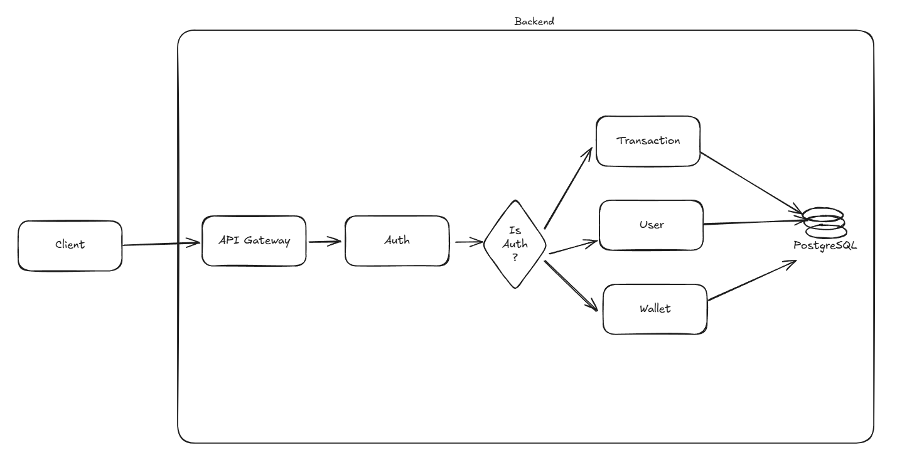

# Second Architectural Idea for Wallet Service Assignment

This document contains information about the initial architectural ideas for project 'Wallet Service Assignment' and insights into the technologies and tools used in early commits.

---

---

After defining the domains, it’s important to carefully consider the security of the application. To address this, we created a dedicated domain responsible for managing authentication and authorization in our virtual wallet.
