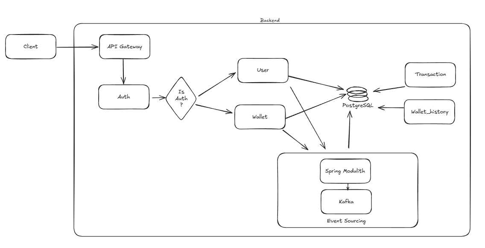

# Third Architectural Idea for Wallet Service Assignment

This document contains information about the initial architectural ideas for project 'Wallet Service Assignment' and insights into the technologies and tools used in early commits.

---

---

After defining the boundaries and structuring each domain’s responsibilities, I realized the architecture was too complex for Spring Modulith to handle events entirely on its own. I made extensive use of the library, implementing the Outbox pattern almost natively — storing each registered event in a separate table.

To further improve event handling, I integrated Spring Modulith with Kafka, allowing it to process internal events externally using the CQRS pattern.

Additionally, I chose to handle wallet statements and transactions entirely through events, ensuring that any wallet update is consistently reflected in its transaction history.
