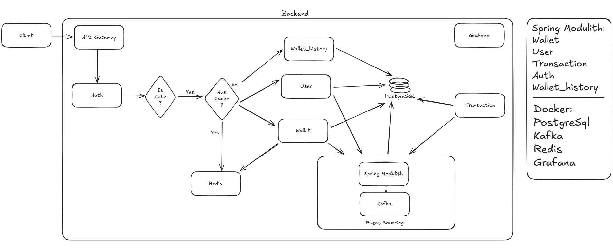

# Final Architectural Idea for Wallet Service Assignment

This document contains information about the initial architectural ideas for project 'Wallet Service Assignment' and insights into the technologies and tools used in early commits.

---

---

To improve the application's response time, I decided to add a cache with Redis, taking advantage of the fact that it is a distributed, high-performance in-memory database. In addition, to monitor the system, I chose to use Grafana, which allows the creation of interactive dashboards from the collection of metrics and logs.
