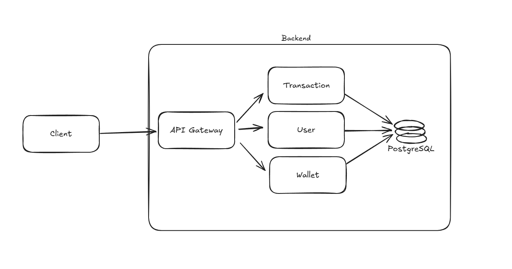

# First Architectural Idea for Wallet Service Assignment

This document contains information about the initial architectural ideas for project 'Wallet Service Assignment' and insights into the technologies and tools used in early commits.

---

---

The main idea is to separate the application domains according to the standards described in Domain Driven Design (DDD). To facilitate the process of breaking down the domains, I chose to use the hexagonal architecture. To respect the DDD rules as much as possible and not 'invade' any domain, I will use Spring Modulith, which consists of publishing and listening to events.

I decided to separate them into three main domains: wallets, users and transactions. To persist the information, I chose the PostgreSQL database because it is a robust, consistent, Spring-compatible, relational database where I can strongly model the relationships of my entities.
